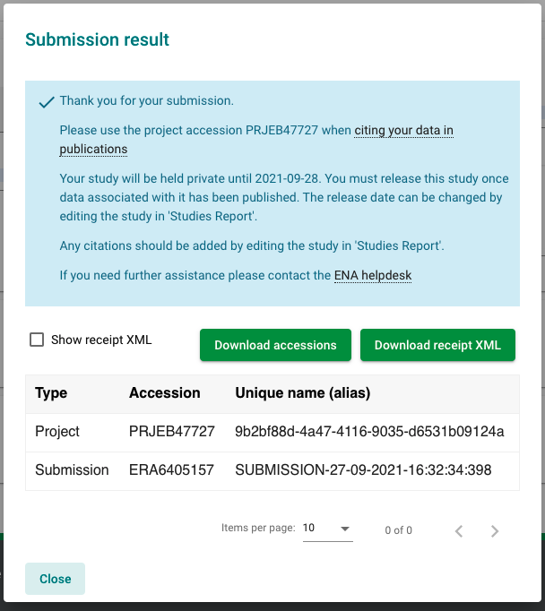

# SARS-CoV-2 Submissions Workshop Markdown

## Introduction

In this workshop, we will step through the available options to submit SARS-CoV-2 data to the European 
Nucleotide Archive using example data. For a complete submissions guide, please see 
[here](sars-cov-2-submissions.html).

### Metadata Model Guide

Before submitting any data, it is important to understand
the structure of our 
[metadata model](https://ena-docs.readthedocs.io/en/latest/submit/general-guide/metadata.html).
This model is used, not only for SARS-CoV-2 data, but data from across the tree of life. In this 
short video, I will touch on the importance of each element of the model and what data/metadata each
object holds.

<div style="position: relative; padding-bottom: 56.25%; height: 0; overflow: hidden; max-width: 100%; height: auto;">
    <iframe src="https://www.youtube.com/embed/ChCsqoq-r-Y" frameborder="0" allowfullscreen style="position: absolute; top: 0; left: 0; width: 100%; height: 100%;"></iframe>
</div>


### Submission Routes

* programmatic: most suitable for high-throughput, frequent submissions and automated systems
* interactive: most suitable for infrequent submission, or those more comfortable with spreadsheets
* drag-and-drop uploader: most suitable for once-off submission

:::{note}
We will use the test servers for this workshop. These service URLs begin with `wwwdev`
instead of `www`. Submissions to this service are removed nightly. 
:::

### Workshop Setup

Before we begin, please download the example data [here](###TODO####) and unzip it.

For this tutorial, you will need:
- a means to view/edit spreadsheets in Microsoft Excel format and a text editor,
ideally something with syntax highlighting for XML formatted files.
- a command line utility with [cURL](https://curl.se/) installed.
- basic command line skills.
- a Webin account. If you don't already have one, please register [here](https://www.ebi.ac.uk/ena/submit/webin/accountInfo).


## Registering a Study

Let's start by registering a study. There are 2 ways to do so: interactively through our 
[Webin Submission Portal](https://wwwdev.ebi.ac.uk/ena/submit/webin/login), or programmatically
using cURL.

### Interactive

Head over to the [Webin Submission Portal](https://wwwdev.ebi.ac.uk/ena/submit/webin/login)
and log in using your Webin credentials to access the landing page.  Here, menus are color-coded
in line with the metadata model. Study-related items are in yellow. Click on the 'Register Study'
button.


Fill out info here: 



You're done!

### Programmatic

Programmatic submissions generally require files in XML format. To register a new study,
we will need 2 XML files:
- one XML to define the study metadata
- and another to define the submission action

Examples of both of these files are available in the example materials unzipped earlier (see [Workshop Setup](#workshop-setup)).
Navigate to the `example_data/study/programmatic` directory to find the example files:

```bash
export WORKSHOP=/path/to/example_data/
cd $WORKSHOP/study/programmatic/
ls
```

As covered in the video on our metadata model, aliases are an important way to identify and
link your data. Please edit `project.xml` to create a project alias that is unique to you.
Once complete, you are ready to send both XMLs to our test service using cURL:

```bash
curl -u username:password -F "SUBMISSION=@submission.xml" -F "PROJECT=@project.xml" "https://wwwdev.ebi.ac.uk/ena/submit/drop-box/submit/"
```

:::{note}
The `submission.xml` file used here defines the `<ADD/>` action. This means that we are requesting
a _new_ project.

Other actions include `<MODIFY/>` to submit changes to existing objects, or `<HOLD/>` to define
when your data should become public. For more information, see 
[our submission XML documentation](https://ena-docs.readthedocs.io/en/latest/submit/general-guide/programmatic.html#submission-xml).
:::

After running the above command, you will recieve a reply in the form of a 'receipt XML'. This 
will contain information about the contents and success of your submission, as well as your study accession.
It is very important take note of your study accession as we will use this later to submit other objects to this study.

For more general information on programmatic study registration, please see [our documentation](https://ena-docs.readthedocs.io/en/latest/submit/study/programmatic.html).


## Registering Samples

Sample video, introduction to ERC000033 checklist, mandatory metadata, INSDC missing values
Overview of our 3 samples 


```xml
<?xml version="1.0" encoding="UTF-8"?>
<?xml-stylesheet type="text/xsl" href="receipt.xsl"?>
<RECEIPT receiptDate="2021-09-29T16:58:08.634+01:00" submissionFile="submission.xml" success="true">
   <PROJECT accession="PRJEB123456" alias="example_project_alias" status="PRIVATE" />
   <SUBMISSION accession="ERA123456" alias="example_submission_alias" />
   <MESSAGES>
        <INFO>This submission is a TEST submission and will be discarded within 24 hours</INFO>
   </MESSAGES>
   <ACTIONS>ADD</ACTIONS>  
</RECEIPT>
```
