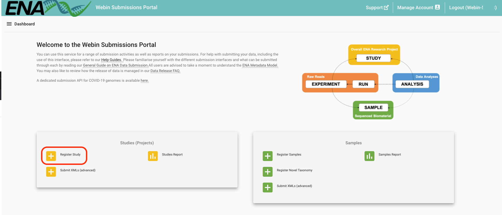
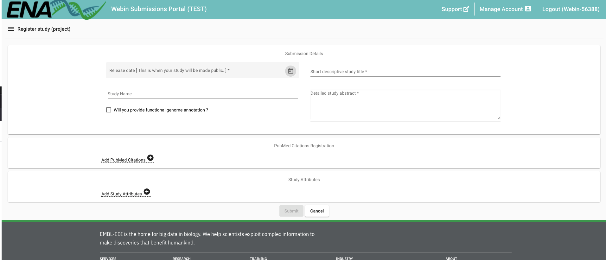
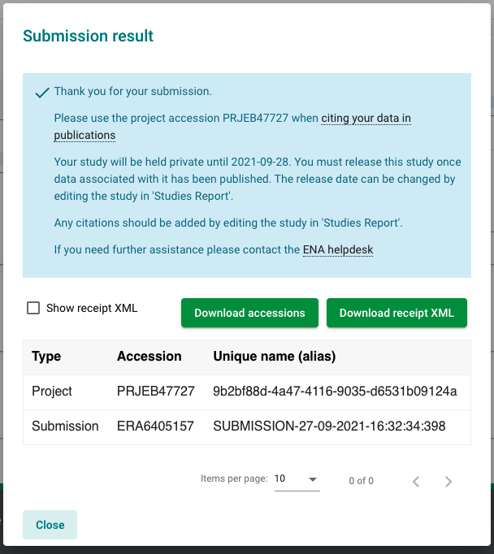

# SARS-CoV-2 Submissions Workshop Markdown

## Introduction

In this workshop, we will step through the available options to submit SARS-CoV-2 data to the European 
Nucleotide Archive using example data. For a complete submissions guide, please see 
[here](sars-cov-2-submissions.html).

### Metadata Model Guide

Before submitting any data, it is important to understand
the structure of our 
[metadata model](https://ena-docs.readthedocs.io/en/latest/submit/general-guide/metadata.html).
This model is used, not only for SARS-CoV-2 data, but data from across the tree of life. In this 
short video, I will touch on the importance of each element of the model and what data/metadata each
object holds.

<div style="position: relative; padding-bottom: 56.25%; height: 0; overflow: hidden; max-width: 100%; height: auto;">
    <iframe src="https://www.youtube.com/embed/ChCsqoq-r-Y" frameborder="0" allowfullscreen style="position: absolute; top: 0; left: 0; width: 100%; height: 100%;"></iframe>
</div><br/>


### Submission Routes

- programmatic: most suitable for high-throughput, frequent submissions and automated systems
- interactive: most suitable for infrequent submission, or those more comfortable with spreadsheets
- drag-and-drop uploader: most suitable for once-off submission

```{note}
We will use the test servers for this workshop. These service URLs begin with `wwwdev`
instead of `www`. Submissions to this service are removed nightly. 
```

### Workshop Setup

Before we begin, please download the example data [here](###TODO####) and unzip it.

For this tutorial, you will need:
- a means to view/edit spreadsheets in Microsoft Excel format and a text editor,
ideally something with syntax highlighting for XML formatted files.
- a command line utility with [cURL](https://curl.se/) installed.
- basic command line skills.
- a Webin account. If you don't already have one, please register [here](https://www.ebi.ac.uk/ena/submit/webin/accountInfo).


## Registering a Study

Let's start by registering a study. There are 2 ways to do so: interactively through our 
[Webin Submission Portal](https://wwwdev.ebi.ac.uk/ena/submit/webin/login), or programmatically
using cURL.

### Interactive

Head over to the [Webin Submission Portal](https://wwwdev.ebi.ac.uk/ena/submit/webin/login)
and log in using your Webin credentials to access the landing page.  Here, menus are color-coded
in line with the metadata model. Study-related items are in yellow. Click on the 'Register Study'
button.



Fill out info here: 



You're done!

### Programmatic

Programmatic submissions generally require files in XML format. To register a new study,
we will need 2 XML files:

- one XML to define the study metadata
- and another to define the submission action

Examples of both of these files are available in the example materials unzipped earlier (see [Workshop Setup](#workshop-setup)).
Navigate to the `example_data/study/programmatic` directory to find the example files:

```bash
export WORKSHOP=/path/to/example_data/
cd $WORKSHOP/study/programmatic/
ls
```

As covered in the video on our metadata model, aliases are an important way to identify and
link your data. Please edit `project.xml` to create a project alias that is unique to you.
Once complete, you are ready to send both XMLs to our test service using cURL:

```bash
curl -u username:password -F "SUBMISSION=@submission.xml" -F "PROJECT=@project.xml" "https://wwwdev.ebi.ac.uk/ena/submit/drop-box/submit/"
```

```{note}
The `submission.xml` file used here defines the `<ADD/>` action. This means that we are requesting
a _new_ project.

Other actions include `<MODIFY/>` to submit changes to existing objects, or `<HOLD/>` to define
when your data should become public. For more information, see 
[our submission XML documentation](https://ena-docs.readthedocs.io/en/latest/submit/general-guide/programmatic.html#submission-xml).
```

After running the above command, you will recieve a reply in the form of a 'receipt XML'. This 
will contain information about the contents and success of your submission, as well as your study accession.
It is very important take note of your study accession as we will use this later to submit other objects to this study.

For more general information on programmatic study registration, please see [our documentation](https://ena-docs.readthedocs.io/en/latest/submit/study/programmatic.html).


## Registering Samples

<div style="position: relative; padding-bottom: 56.25%; height: 0; overflow: hidden; max-width: 100%; height: auto;">
    <iframe src="https://www.youtube.com/embed/ChCsqoq-r-Y" frameborder="0" allowfullscreen style="position: absolute; top: 0; left: 0; width: 100%; height: 100%;"></iframe>
</div><br/>

- [ERC000033 metadata checklist](https://www.ebi.ac.uk/ena/browser/view/ERC000033)
- [INSDC missing value reporting](https://ena-docs.readthedocs.io/en/latest/submit/samples/missing-values.html?highlight=insdc%20missing#reporting-missing-values)


### Interactive

For this, we will use the materials in the `samples/interactive/` folder of the example data. Here, we have the same spreadsheet in 2 different formats : 

- `sample_spreadsheet.xlsx` : this is in Excel format and has been annotated with colour-coding to highlight important features
- `sample_spreadsheet.tsv` : tab-separated version of the above spreadsheet - this is the format accepted by Webin 

In both cases, each row represents a sample and each column represents a metadata field.

#### Video 

### Programmatic

Here, we will use the materials in the `samples/programmatic` folder of the example data. Here, you will find several XML files:

- `samples.xml` : this contains the same set of samples as those submitted interactively in the previous section.
- `submission.xml` : this XML is the same as that used to submit your study. It defines the `<ADD/>` action to create new samples.
- `submission_modify.xml` : this submission XML defines the `<MODIFY/>` action, to allow us to update existing samples.

#### Samples XML 
The samples XML format allows us to define many samples inside a `<SAMPLE_SET>` tag. Each sample (enclosed in `<SAMPLE>` tags), 
contains:

- `<TITLE>` tags : defining the title of the sample
- `<SAMPLE_NAME>` tags : defining the taxonomic information
- `<DESCRIPTION>` tags : providing a description of what's been sampled and 
- many `<SAMPLE_ATTRIBUTE>` tags : defining all other metadata fields

```{note}
Sample aliases are defined within the `<SAMPLE>` tag, e.g. `<SAMPLE alias='this_alias'>`.
In the example data, the alias has been suffixed with the word 'programmatic'. This is to avoid clashes with the same samples 
that were submitted interactively in the previous section. Aliases must be unique.
```

#### Submit the samples
As we did with study registration, let's send the samples XML and submission XML (with the `<ADD/>` action) to our test service
using cURL to perform a submission:
```bash
curl -u username:password -F "SUBMISSION=@submission.xml" -F "SAMPLE=@samples.xml" "https://wwwdev.ebi.ac.uk/ena/submit/drop-box/submit/"
```

Again, you should receive a receipt XML with information about submission success and accession numbers. Note that this time, you
will receive a `<SAMPLE>` tag for each submitted sample (in this case, 3). Please take note of each sample alias and accession as
we will use these later to submit data files against.

For more general information on programmatic sample registration, please see [our documentation](https://ena-docs.readthedocs.io/en/latest/submit/samples/programmatic.html).

#### Modifying a sample
Sample metadata can be updated at a later date. This can be achieved by editing the sample XML file to update the relevant fields, 
and resubmitting with a submission XML containing the `<MODIFY/>` action in place of `<ADD/>`.

First, check your submitted sample in our browser using one of your accessions in the search box: https://wwwdev.ebi.ac.uk/ena/browser/home

Now, open the `samples.xml` file and update a metadata field of your choice. e.g. new collection date. Save the file.

This time, we will submit with the `submission_modify.xml`, which instructs the service to update an existing sample. This uses the alias
to detect existing samples, so it is important not to change the alias.
```bash
curl -u username:password -F "SUBMISSION=@submission_modify.xml" -F "SAMPLE=@samples.xml" "https://wwwdev.ebi.ac.uk/ena/submit/drop-box/submit/"
```

Check your sample on the browser again, and see that the metadata has been updated *** IS THIS INSTANT?? ***

```{warning}
Although sample metadata can be updated, these updates are not automatically propagated to the EMBL files of their sequences. This 
is due to computational constraints.

Updating samples will be reflected in the sample page in the ENA browser, the BioSamples record, and the [COVID-19 Data Portal](https://www.covid19dataportal.org/).

If it is very important for your EMBL files to be updated with new metadata, please contact our helpdesk at virus-dataflow@ebi.ac.uk and 
we will endeavour to assist you.
```
